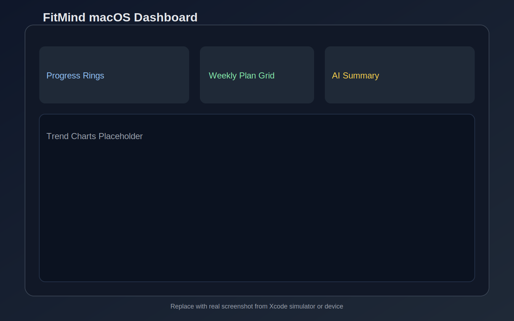
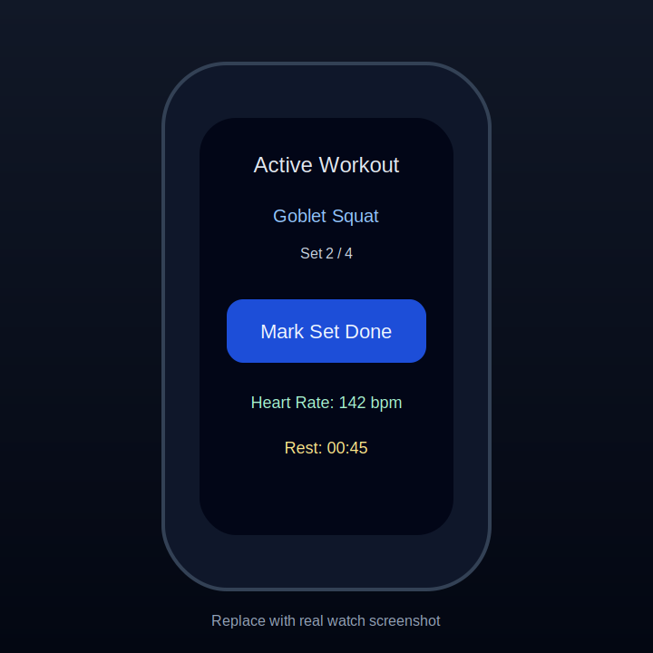

# FitMind

AI-powered fitness coaching app for macOS 14+ and watchOS 10+, backed by a local MCP server that can call OpenAI, Anthropic Claude, or a deterministic mock provider.

## Project Status

- `mcp-server`: Implemented with all required endpoints, schema validation, provider switching, tests, and CI.
- `FitApp-macOS`: SwiftUI + SwiftData app with local Sign in with Apple gate, onboarding, dashboard, generator, insights, history analytics, settings, offline fallback, and service layer.
- `FitApp-watchOS`: SwiftUI companion scaffold implemented for active workout flow, quick stats, local cache, and WatchConnectivity sync.
- `Xcode project`: wired targets are committed with watchOS HealthKit entitlements and HealthKit privacy usage strings; set signing team if needed.

## Screenshots




Placeholder images are committed; replace them with real captures under `docs/screenshots/` when available.

## Architecture and API

- High-level architecture: `docs/architecture.md`
- API payload examples: `docs/api.md`
- OpenAPI contract: `docs/openapi.yaml`

## Repo Layout

```
fitapp/
├── FitApp-macOS/
│   ├── Views/
│   ├── Models/
│   ├── Services/
│   └── FitApp_macOS.xcodeproj/
├── FitApp-watchOS/
│   ├── Views/
│   ├── Services/
│   └── Models/
├── mcp-server/
│   ├── src/
│   ├── .env.example
│   ├── package.json
│   └── README.md
├── docs/
├── .github/workflows/
├── LICENSE
├── README.md
└── .gitignore
```

## MCP Server Setup

1. Clone repo:

   ```bash
   git clone https://github.com/Rohan5commit/fitapp.git
   cd fitapp
   ```

2. Install Node 20+.
3. Copy env template.

   ```bash
   cd mcp-server
   cp .env.example .env
   ```

4. Configure provider + API key in `.env`.
5. Install dependencies and run:

   ```bash
   npm install
   npm run dev
   ```

   Optional smoke test (in another terminal):

   ```bash
   ./mcp-server/scripts/smoke_test.sh
   ```

Optional deterministic mode for UI development:

```
AI_PROVIDER=mock
MOCK_SCENARIO=balanced
```

The server exposes:
- `POST /analyze-trends`
- `POST /generate-plan`
- `POST /recommend-adjustments`
- `GET /health`

Optional request headers (`x-fitmind-provider`, `x-fitmind-openai-key`, `x-fitmind-anthropic-key`) let the macOS app choose provider/keys per request without changing `.env`.

## App Setup (Xcode)

1. Open `FitApp-macOS/FitApp_macOS.xcodeproj` in Xcode.
2. Confirm bundle identifiers, signing team, and deployment settings for both app targets.
3. Run macOS app target first, then watchOS target.
4. Sign in locally with Apple when prompted.
5. In app Settings, set MCP URL, choose provider (`OpenAI`/`Claude`/`Mock`), save API keys in Keychain, and optionally enable HealthKit sync for manual logs.

## CI

GitHub Actions workflows:

- `.github/workflows/mcp-server-ci.yml`
- `.github/workflows/apple-targets-ci.yml`

- `mcp-server-ci.yml` runs install, typecheck, tests, and build for `mcp-server`.
- `apple-targets-ci.yml` builds macOS and watchOS app targets with `xcodebuild` on GitHub-hosted macOS runners.

## Reclaim Local Storage

After wiring/building in Xcode locally, reclaim space with:

```bash
./scripts/cleanup_xcode_artifacts.sh
```

Optional full simulator cleanup:

```bash
./scripts/cleanup_xcode_artifacts.sh --full-sim
```

## License

MIT (`LICENSE`)
