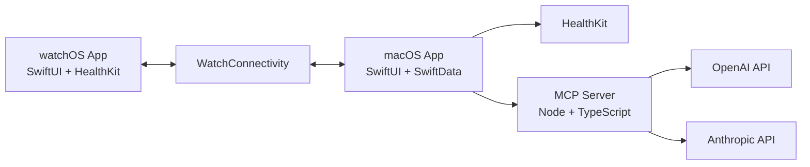

# Architecture

## Data Flow

1. User updates profile and preferences in macOS onboarding/settings.
2. macOS app sends request payloads to MCP endpoints.
3. MCP server routes to selected AI provider and enforces JSON response schema.
4. macOS app stores plans/logs in SwiftData.
5. macOS syncs the current workout and receives completed set updates from watchOS via WatchConnectivity.
6. HealthKit data informs insights and trend analysis.
